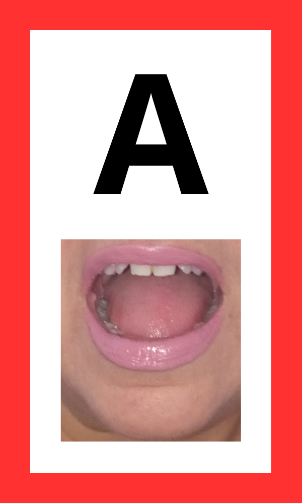
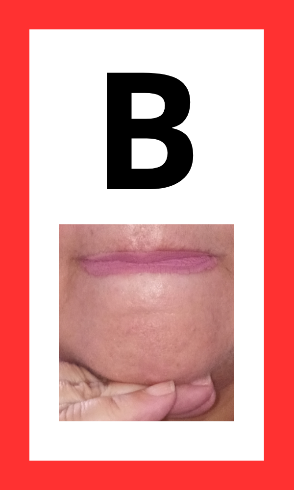
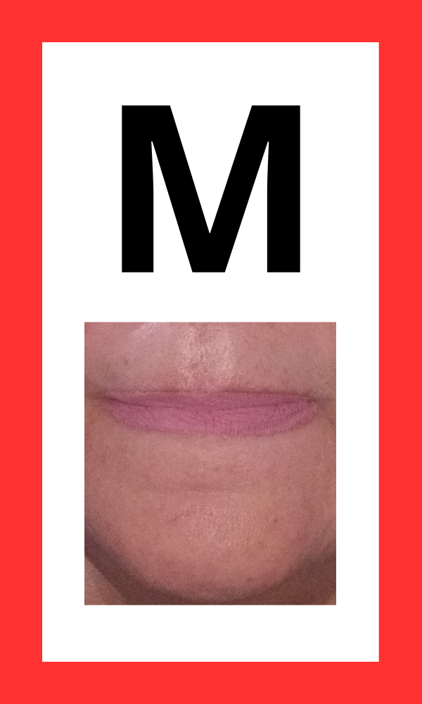

# FalaMarcelao

The FalaMarcelão App consists of an intuitive interface that takes a sentence or word in Brazilian Portuguese and converts it into images of mouths representing the sounds of each phoneme. The app also offers text-to-speech functionality with speed control, allowing users to adjust the pronunciation speed as needed. For this reason, FalaMarcelão is ideal for patients with aphasia or apraxia who have the ability to write words or short sentences. See below:


The FalaMarcelão app is now available on the Microsoft Store. <a href="https://apps.microsoft.com/detail/9nl10c8s34fp?hl=pt-br&gl=BR" target="_blank">Click here</a> to download.

## Table of Contents

- [Installation](#installation)
- [Project Background](#project-background)
- [Mouth Image Database](#mouth-image-database)
- [Contributing to the Project](#contributing-to-the-project)
  
## Installation
- Clone the repository:
    ```bash
    git clone https://github.com/Mario200212/FalaMarcelao.git
    ```
## Project Background
- Language Used: C#
- Framework Used: .NET MAUI
### Development Notes: 
In general, for the development of the application, only two files from this repository were used:
- MainPage.xaml: Used to create the visual interface of the application
- MainPage.xaml.cs: Used for building the entire backend of the application (Text-to-Speech, Text-to-Mouths, ...)

## Mouth Image Database
The project's image files are available in the 'Resources/Images' folder. See some examples below:
<div style="display: flex; justify-content: space-between;">
    
    
    
</div>


## How to Contribute

There are several ways you can contribute to this project:

### 1. Expanding the App to Other Languages

**Mouth Images:**
- You can provide photos of mouths representing all the phonemes of a language you know.
- If photos of the phonemes for a given language already exist, you can use tools like Canva to format the images according to the following pattern:


**Programming:**
- If you are proficient in C# with the .NET MAUI framework, you can help by implementing the logic to convert Text to Mouths (see `MainPage.xaml.cs` for reference).
- **Note 1:** If you are adding support for a language other than Brazilian Portuguese, please fork the initial repository and submit your changes as a new branch. I will merge your implemented language with the existing ones into a single app.
- **Note 2:** We will always give proper credit for all contributions made by our contributors.

### 2. Enhancing the Current App

- You can improve the algorithm used for converting Text to Mouths, as well as implement any new features or ideas that you believe would enhance the current app.


Thank you for your interest in contributing to the project!


